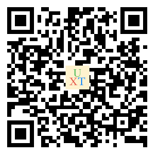

# uxt

#### 介绍
[uniapp](https://uniapp.dcloud.io/)组件库

#### 软件架构
参考color-ui封装为uniapp组件库，在h5, 微信小程序, android端进行了测试。

#### 安装教程

1. `npm init -y`初始化您的项目。
2. `npm install @xtcoder/uxt`安装uxt包，最新版本`1.0.1`。
3.  App.vue中导入全局样式。
    ``` scss
    <style lang="scss">
    @import '@xtcoder/uxt/uxt.scss';
    </style>
    ```
4.  main.js中导入uxt。
    ``` js
    import uxt from '@xtcoder/uxt/uxt.js'
    import uxtPage from '@xtcoder/uxt/components/uxt-page.vue'

    Vue.component('uxt-page', uxtPage)
    Vue.use(uxt)
    ```
5.  pages.json关闭原生导航栏。
    ``` json
    "globalStyle": {
		"navigationStyle": "custom"
	}
    ```
6.  很多组件中带有默认主题色(默认为绿色)，如需更换默认主题颜色，可在uni.scss文件中增加如下变量。
	``` scss
	$theme-color: #0081ff;
	$theme-color-text: #fff;
	$theme-color-light: #cce6ff;
	$theme-color-gradual1: #0081ff;
	$theme-color-gradual2: #1cbbb4;
	```

> HBuilder X 2.6.1

#### 使用说明

编写中，敬请期待。

#### 先睹为快


H5 (请使用手机浏览器扫码体验)


微信小程序 (请使用微信扫一扫功能扫码体验)



Android (请使用手机浏览器扫码下载安装后体验)